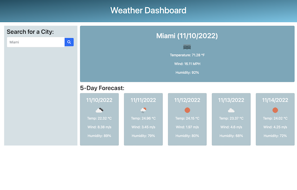
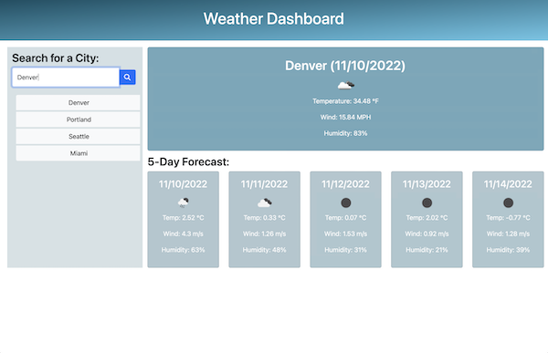

# Module 6 Server-Side APIs: Weather Dashboard

## Description

A weather dashboard application that allows the user to input a local city and displays the current weather and 5 day forecast for that local city. The Open Weather Map API is used to retrieve weather data, and localStorage is used to store previous search queries. The city name, date, temperature, wind speed, and humidity are all data displayed on the webpage. JavaScript, JQuery, Bootstrap, and Moment.js are all heavily implemented in this application.

Link to deployed application: https://monicapong.github.io/weatherDashboard

## Usage

To use this weather dashboard application, the user simply inputs the name of a city in the search box and click on the search button. The city name, current date, weather icon, temperature, wind speed, and humidity are displayed. Below that, a 5 day forecast of the city including the date, forcasted weather icon, temperature, wind speed, and humidity are displayed. To see the weather data of a previoius search, simply click on that city's search history button. 

## License

Please refer to the GitHub Repository for licensing information. 
Link to GitHub repository: https://github.com/monicapong/weatherDashboard
